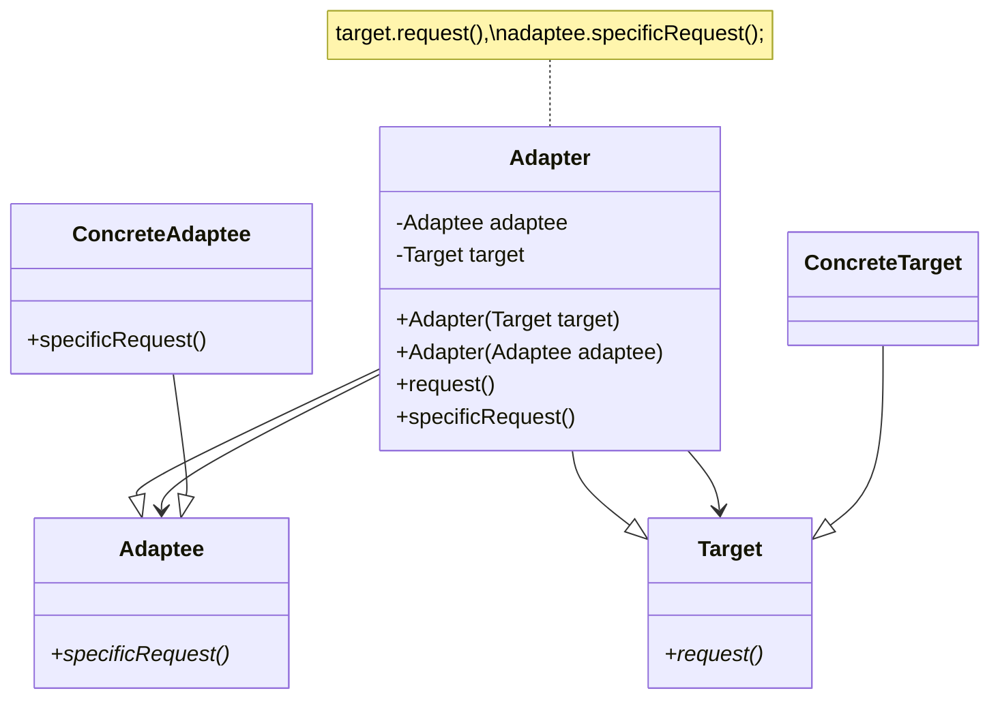

## 类图

```mermaid
classDiagram
    class Adaptee {
        +specificRequest()*
    }
    class Target {
        +request()*
    }
    class ConcreteAdaptee {
        +specificRequest()
    }
    class ConcreteTarget {
    }
    class Adapter {
        -Adaptee adaptee
        -Target target
        +Adapter(Target target)
        +Adapter(Adaptee adaptee)
        +request()
        +specificRequest()
    }
    note for Adapter "target.request(),\nadaptee.specificRequest();" 
    Adapter --|> Adaptee
    Adapter --|> Target
    Adapter --> Adaptee
    Adapter --> Target
    ConcreteAdaptee --|> Adaptee
    ConcreteTarget --|> Target
```
