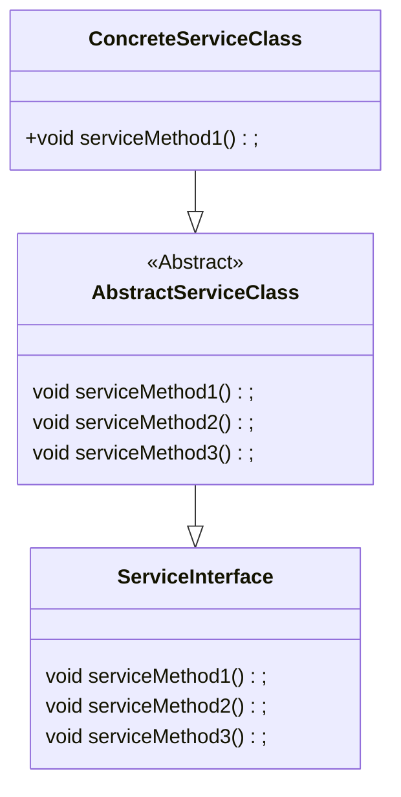

## 类图

```mermaid
classDiagram
    class ServiceInterface {
        void serviceMethod1();
        void serviceMethod2();
        void serviceMethod3();
    }
    class AbstractServiceClass {
        <<Abstract>>
        void serviceMethod1();
        void serviceMethod2();
        void serviceMethod3();
    }
    class ConcreteServiceClass {
        +void serviceMethod1();
    }
    ConcreteServiceClass --|> AbstractServiceClass
    AbstractServiceClass --|> ServiceInterface
```
