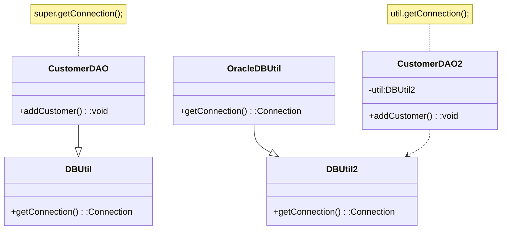

## 类图

```mermaid
classDiagram
    class DBUtil {
        +getConnection():Connection
    }
    class CustomerDAO {
        +addCustomer():void
    }
    note for CustomerDAO "super.getConnection();" 
    CustomerDAO --|> DBUtil
    class DBUtil2 {
        +getConnection():Connection
    }
    class OracleDBUtil {
        +getConnection():Connection
    }
    OracleDBUtil --|> DBUtil2
    class CustomerDAO2 {
        -util:DBUtil2
        +addCustomer():void
    }
    note for CustomerDAO2 "util.getConnection();" 
    CustomerDAO2 ..> DBUtil2
```
