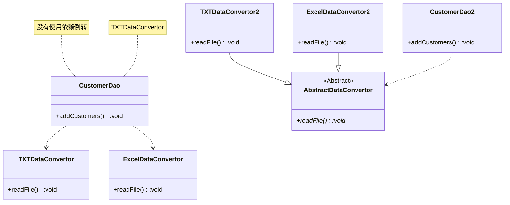

## 类图

```mermaid
classDiagram
    class TXTDataConvertor {
        +readFile():void
    }
    class ExcelDataConvertor {
        +readFile():void
    }
    class CustomerDao {
        +addCustomers():void
    }
    note for CustomerDao "没有使用依赖倒转" 
    CustomerDao ..> TXTDataConvertor
    CustomerDao ..> ExcelDataConvertor
    class AbstractDataConvertor {
        <<Abstract>>
        +readFile():void*
    }
    class TXTDataConvertor2 {
        +readFile():void
    }
    class ExcelDataConvertor2 {
        +readFile():void
    }
    class CustomerDao2 {
        +addCustomers():void
    }
    note for CustomerDao "<classNmae>TXTDataConvertor</className>"
    TXTDataConvertor2 --|> AbstractDataConvertor
    ExcelDataConvertor2 --|> AbstractDataConvertor
    CustomerDao2 ..> AbstractDataConvertor
```
