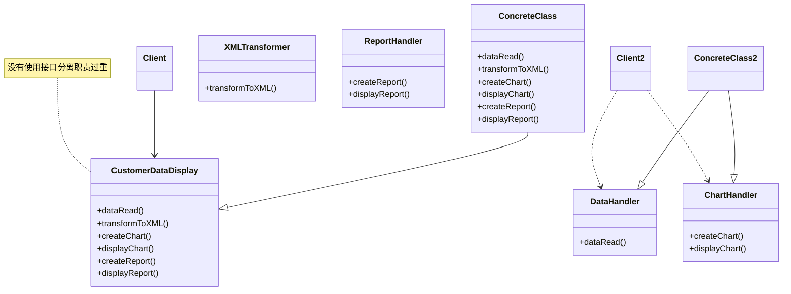

## 类图

```mermaid
classDiagram
    class Client {
    }
    class CustomerDataDisplay {
        +dataRead()
        +transformToXML()
        +createChart()
        +displayChart()
        +createReport()
        +displayReport()
    }
    note for CustomerDataDisplay "没有使用接口分离职责过重" 
    class ConcreteClass {
        +dataRead()
        +transformToXML()
        +createChart()
        +displayChart()
        +createReport()
        +displayReport()
    }
    Client --> CustomerDataDisplay
    ConcreteClass --|> CustomerDataDisplay
    class DataHandler {
        +dataRead()
    }
    class XMLTransformer {
        +transformToXML()
    }
    class ChartHandler {
        +createChart()
        +displayChart()
    }
    class ReportHandler {
        +createReport()
        +displayReport()
    }
    Client2 ..> DataHandler
    Client2 ..> ChartHandler
    ConcreteClass2 --|> DataHandler
    ConcreteClass2 --|> ChartHandler
```
