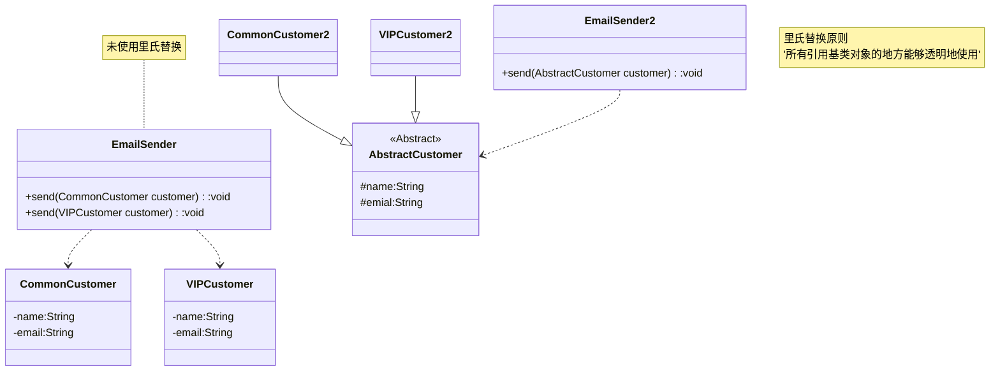

## 类图

```mermaid
classDiagram
    class EmailSender {
        +send(CommonCustomer customer):void
        +send(VIPCustomer customer):void
    }
    note for EmailSender "未使用里氏替换" 
    class CommonCustomer {
        -name:String
        -email:String
    }
    class VIPCustomer {
        -name:String
        -email:String
    }
    EmailSender ..> CommonCustomer
    EmailSender ..> VIPCustomer
    class EmailSender2 {
        +send(AbstractCustomer customer):void
    }
    class AbstractCustomer {
        <<Abstract>>
        #name:String
        #emial:String
    }
    CommonCustomer2 --|> AbstractCustomer
    VIPCustomer2 --|> AbstractCustomer
    EmailSender2 ..> AbstractCustomer


    note "里氏替换原则<br>'所有引用基类对象的地方能够透明地使用'"
```
