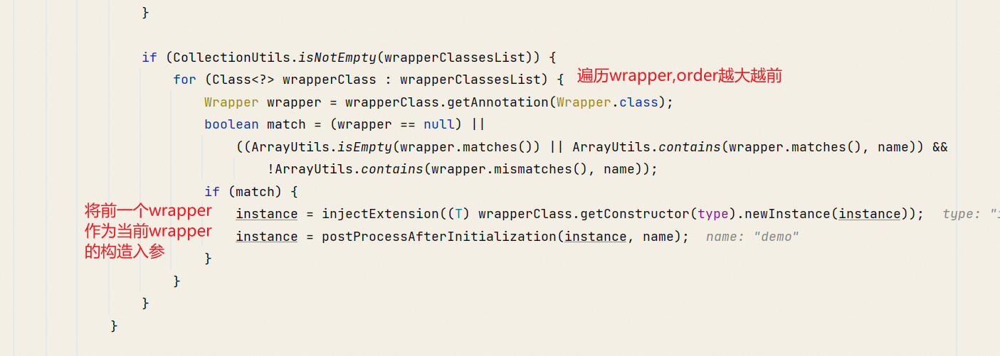

# dubbo

* wrapper 扩展
  1. wrapper需要实现spi
  2. 必须有包含spi的构造方法
  2. wrapper类命名需要wrapper结尾
  3. wrapper实现方式
     * org.apache.dubbo.common.extension.ExtensionLoader#createExtension
       * 排序wrapper, 因为order越小越先执行,所以将order大的往前排
       * 遍历wrapper, order从大到小
       * 第一个wrapper构造对象的时候传入spi
       * 第二个wrapper构造对象的时候传入第一个wrapper... 最终返回order最小的wrapper
         
