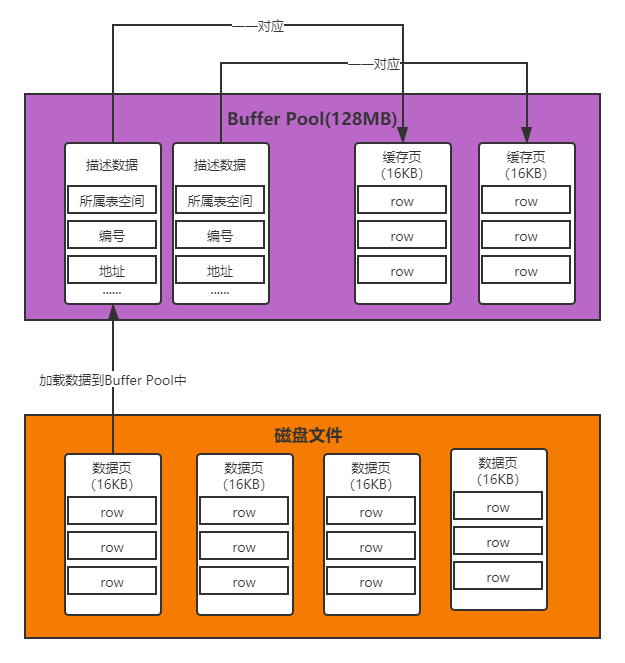
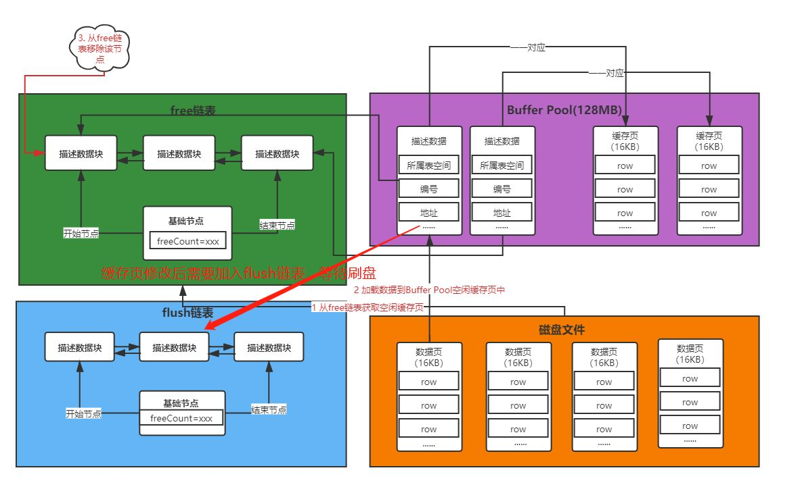
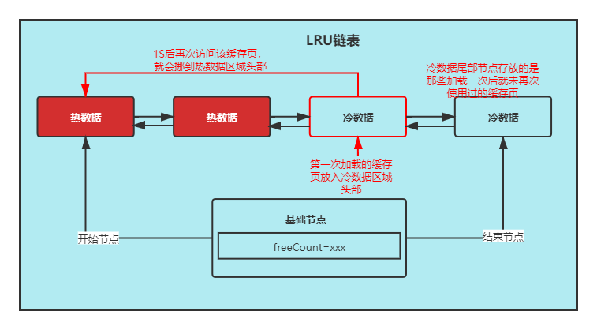

# Mysql

## Innodb

### 事务的ACID特性

1. Atomicity(原子性)
    1. 通过undo.log实现回滚
2. Consistency(一致性)
3. Isolation(隔离性)
    1. 读未提交
        1. 读事务允许读写事务,未提交的写事务允许读事务
    2. 读已提交
        1.读事务允许读事务和写事务,未提交的写事务禁止读事务和写事务
        2. mvcc
            * 每次select重新生成readView
    3. 可重复读
        1. mvcc
            * 第一次select生成readView
    4. 序列化
        1. 串行化执行
4. Durability(持久性)
    1. redo.log
        1. 刷盘的时候如果突然宕机,可以通过redo.log重新写入磁盘

#### mvcc

> readView有下列属性  
> 事务记录属性:DB_TRX_ID(事务id),DB_ROLL_PTR(指向上一条事务地址),记录在undo.log中

1. 已提交最大事务id
2. 活跃中的事务id
3. 当前最大事务id

* 其他事务可以通过readView看到小于等于已提交最大事务id得事务(可见),  
  大于已提交最大事务id小于等于当前最大事务id为活跃id(不可见,当前事务可以看到自己的未提交事务),  
  大于当前最大事务id(不可见)
    * m_up_limit_id(已提交最大事务id)
    * m_low_limit_id(当前最大事务id+1)

## buffer pool

1. 存储结构
    1. 缓存页(16k)
    2. 描述数据(大概占缓存页的5%大小)
        * 对应一个缓存页
        * 记录缓存页元数据信息,包括所属表空间、数据页编号、缓存页在buffer pool中的地址

   

2. 管理及淘汰
    1. 初始化
        * 申请内存,划分缓存页和描述数据,此时缓存页数据是空的,描述数据也只是存储缓存页地址
        * 构造free链表,刚开始是链表是空的,将构造好的空的描述数据加载到链表中
    2. free链表
        * LRU
            * 尾部淘汰，读取过后放入头部
            * 每个节点存储描述数据
            * 双向链表
            * 当数据写入到缓存池后清除节点中数据。
    3. flush链表
        * 每个节点存储描述数据
        * 双向链表
        * 刷盘结束后清除对应节点中的数据

   

3. 查询
    * MYSQL中还有一个哈希表数据结构，用表空间号+数据页号作为key，缓存页的地址作为value。  
      根据key如果查询不为空,则证明数据已经被缓存,如果为空,则从磁盘读取放入缓存
4. 更新
    * 跟磁盘文件不一致的页为脏页(其实就是更新后的数据页)
    * 通过把脏页存储到flush链表来刷盘
5. LRU的缺点及优化
    * 缺点
        * buffer pool的预读机制会导致有些冷数据加入到头部
            * 预读机制是当读取多页相连数据到一定数量时，会把下一条数据也读入缓存
                * innodb_read_ahead_threshold 默认值56 指读的相连数据页超过56页时，会把后面区间的数据也预读进缓存。
                * innodb_random_read_ahead 默认关闭 一个区里的13个连续数据页，并且这些数据都是频繁被访问。  
                  触发预读将该区里的数据也加载进缓存
            * 全表查询会把热数据顶掉
    * 优化
        * 冷热分离
            * innodb_old_blocks_pct 默认37 冷数据占37%
            * innodb_old_blocks 默认1000(单位毫秒)如果一个数据页进入冷数据后，一秒内又被访问，则进到热数据
            * 只有热数据后3/4的数据再次被访问才移到热数据头部

   

## 基础问题
