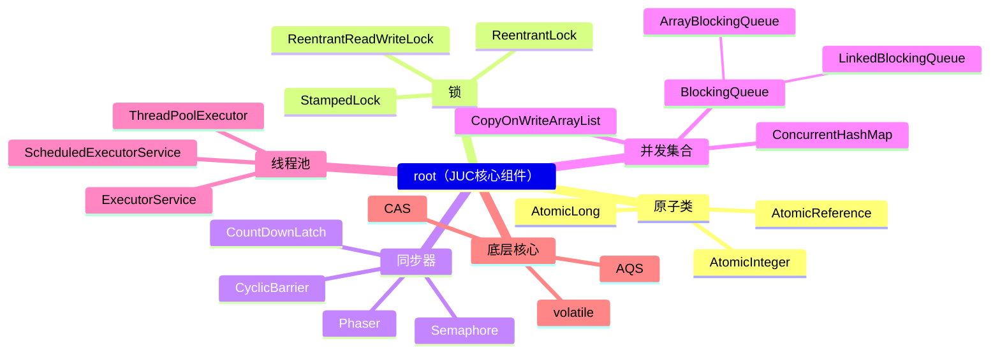

# JUC
> 主要介绍java.util.concurrent 下的并发同步等工具

```mermaid

mindmap
  root（JUC核心组件）
    原子类
      AtomicInteger
      AtomicLong
      AtomicReference
    锁
      ReentrantLock
      ReentrantReadWriteLock
      StampedLock
    同步器
      Semaphore
      CountDownLatch
      CyclicBarrier
      Phaser
    并发集合
      ConcurrentHashMap
      CopyOnWriteArrayList
      BlockingQueue
        ArrayBlockingQueue
        LinkedBlockingQueue
    线程池
      ExecutorService
      ThreadPoolExecutor
      ScheduledExecutorService
    底层核心
      AQS
      CAS
      volatile

```
